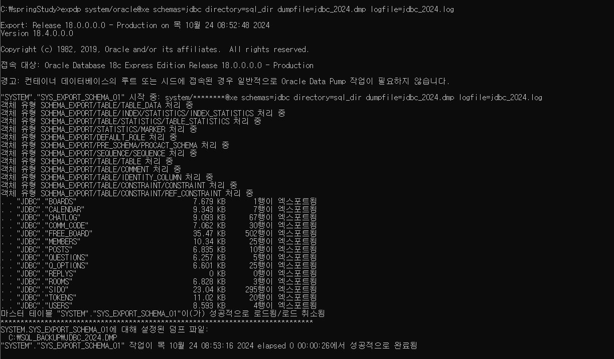

Oracle 18c에서 특정 계정의 덤프 파일을 생성하고 임포트하기 위한 과정은 크게 다음 단계로 나눌 수 있습니다:

1. Data Pump 디렉토리 생성
2. 덤프 파일 생성 (Export)
3. 덤프 파일 임포트 (Import)

## 1. Data Pump 디렉토리 생성

Oracle에서 Data Pump를 사용하여 덤프 파일을 저장하기 위해서는 미리 Oracle 디렉토리 오브젝트를 생성해야 합니다. 이 디렉토리는 Oracle이 읽고 쓸 수 있는 파일 시스템 경로와 연결되어야 합니다. 

### 디렉토리 생성 명령
```sql
CREATE OR REPLACE DIRECTORY sql_dir AS 'C:\sql_backup\';
```

- `C:\sql_backup\`: 덤프 파일을 저장할 실제 파일 시스템 경로입니다. 해당 경로에 Oracle 서버 프로세스가 읽고 쓸 수 있는 권한이 있어야 합니다.


### 권한 부여
Oracle 계정에 생성된 디렉토리를 사용할 수 있는 권한을 부여해야 합니다.

```sql
    GRANT READ, WRITE ON DIRECTORY sql_dir TO jdbc;
```

- `jdbc`: 덤프 파일을 생성할 계정 또는 임포트할 계정.


## 2. 덤프 파일 생성 (Export)

다음은 특정 스키마(계정)의 데이터를 덤프 파일로 내보내는 `expdp` 명령입니다.

### 덤프 파일 생성 명령
```bash
expdp system/oracle@xe schemas=jdbc directory=sql_dir dumpfile=jdbc_2024.dmp logfile=jdbc_2024.log
```

- `system/oracle@xe`: Oracle 데이터베이스의 관리자 계정과 서비스 이름.
- `schemas=jdbc`: 덤프 파일을 생성할 스키마 이름.d
- `directory=sql_dir`: 앞서 생성한 Oracle 디렉토리 이름.
- `dumpfile=jdbc_2024.dmp`: 생성할 덤프 파일 이름.
- `logfile=jdbc_2024.log`: 내보내기 작업 로그를 저장할 파일 이름.

### 예시:




## 3. 덤프 파일 임포트 (Import)

내보낸 덤프 파일을 특정 계정으로 임포트하려면 `impdp` 명령을 사용합니다.

### 덤프 파일 임포트 명령(받는 곳에서도 디렉토리가 있어야함, 아래 명령어는 덤프파일이 있는 경로에서 실행)
```bash
impdp system/oracle@xe schemas=jdbc directory=sql_dir dumpfile=jdbc_2024.dmp logfile=jdbc_2024.log
```

- `schemas=jdbc`: 데이터를 임포트할 스키마 이름.
- `dumpfile=jdbc_2024.dmp`: 내보낸 덤프 파일 이름.
- `logfile=jdbc_2024.log`: 임포트 작업 로그를 저장할 파일 이름.


## 4. 추가 참고 사항

- **Oracle 디렉토리 확인**: 이미 존재하는 Oracle 디렉토리를 확인하려면 다음 SQL을 실행할 수 있습니다.
  ```sql
  SELECT directory_name, directory_path FROM dba_directories;
  ```

- **데이터 펌프 작업 모니터링**: 내보내기 또는 임포트 작업의 진행 상황을 모니터링하려면 Oracle SQL*Plus에서 다음 명령을 사용하여 작업 상태를 확인할 수 있습니다.
  ```sql
  SELECT * FROM dba_datapump_jobs;
  ```

이 과정을 통해 Oracle 18c에서 특정 계정의 덤프 파일을 생성하고 임포트할 수 있습니다.