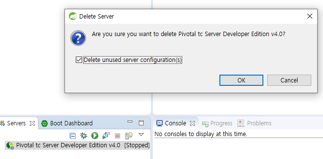

## 프로젝트 설정 

 ### 1. 폴더 생성 (ex. c:\dev_proj)

 ### 2. 필요 자료 가져오기(아래 링크)
  - [sts3.3.9.11](https://download.springsource.com/release/STS/3.9.11.RELEASE/dist/e4.14/spring-tool-suite-3.9.11.RELEASE-e4.14.0-win32-x86_64.zip)
  - [tomcat, jdk, templates](https://drive.google.com/file/d/1RVHLdyHOolfkeC2YP9PMzHTX0OWFhKDG/view?usp=sharing)
 ### 3. workspace 폴더 생성
 ### 4. 폴더에 넣기 
  
 ### 5. jdk 위치설정
  
 ### 6. 실행 및 workspace 선택
  
 ### 7. new -> spring legacy project 선택 (.metadata 생기도록)
  
 ### 8. https-content.xml 위치

    \.metadata\.plugins\org.springsource.ide.eclipse.commons.content.core
    org.springframework.templates.mvc-3.2.2 폴더 위치
    \.metadata\.sts\content 

   

 ### 9. encoding 설정(utf-8) 링크 참고하세요
 [utf-8설정](https://class.soyiyou.com/6) 

 ### 10. apache tomcat 설정 
  - 디폴트 서버 삭제 
  
  - new server 선택
  
  - apache tomcat 9 (borwse 선택하여 설정 폴더에 있는 톰켓 폴더 선택, jdk 선택)
  

 ### 11. spring legacy proejct 프로젝트 생성 (project 명 설정, Srping MVC Project 선택)
  
 ### 12. pakage 설정 (ex. com.proj.my)
  
 ### 13. maven 버전 설정 후 -> Maven -> update project
  
 ### 14. servers에 프로젝트 add 
   
 ### 15. server 실행 및 접속 테스트
   

 ## 이후 

 - DB 연결 및 테스트
 - 기본 UI 설정
 
